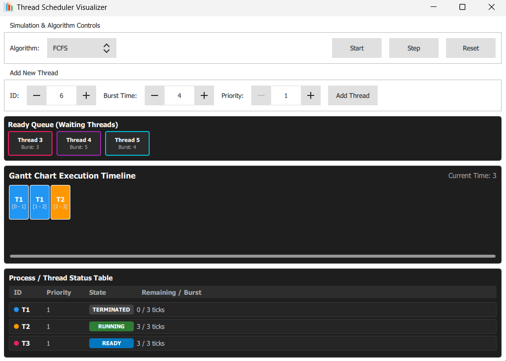

# Thread Scheduler Visualizer

Thread Scheduler Visualizer is a cross-platform desktop application designed to model, simulate, and analyze operating system thread scheduling algorithms in real time. Built with C++17 and Qt/QML, it provides an intuitive graphical interface for examining CPU scheduling mechanics, context switches, and performance metrics.

---

## Key Features

* Core Scheduling Algorithms: Out-of-the-box support for First-Come, First-Served (FCFS) and Round Robin (RR) scheduling policies.
* Real-Time Simulation & Control: Interactive timeline control with play, pause, and timer adjustments.
* Comprehensive Metrics: Live tracking of Turnaround Time, Waiting Time, Response Time, and CPU Utilization.
* Cross-Platform GUI: Native desktop experience across Windows and Linux, featuring vectorized icons and clean window architecture without unwanted console popups.
* Robust Containerized Environment: Docker support and GitHub Actions CI pipelines ensuring reproducible builds and automated testing.

---

## Tech Stack

* Language: C++17
* Framework: Qt 5 (Core, GUI, Qml, Quick, Svg)
* Build System: CMake (>= 3.16), Ninja
* Testing: GoogleTest
* CI/CD & Virtualization: GitHub Actions, Docker (Ubuntu 22.04 LTS)

---

## Prerequisites & System Requirements

Before building the project, ensure your system has the following dependencies installed:
* C++ Compiler supporting C++17 (MSVC 2019+, GCC 11+, or Clang)
* CMake (version 3.16 or higher)
* Qt 5 development libraries
  * On Ubuntu/Debian: sudo apt-get install build-essential cmake qtbase5-dev qtdeclarative5-dev libqt5svg5-dev qml-module-qtquick2

---

## Installation & Building from Source

1. Clone the repository
2. Configure the project with CMake:
   cmake -B build -S . -DCMAKE_BUILD_TYPE=Release -DBUILD_TESTS=ON
3. Build the application:
   cmake --build build --config Release
4. Run the executable:
   * Windows: build\Release\thread_scheduler_visualizer.exe
   * Linux: ./build/thread_scheduler_visualizer

---

## Running Tests

The project includes unit tests for core scheduling algorithms using GoogleTest. To run them:
1. Build with tests enabled (-DBUILD_TESTS=ON).
2. Execute tests via CTest:
   ctest --test-dir build --output-on-failure

---

## Dockerized Development (Linux)

If you prefer an isolated Linux build environment:
1. Build the Docker image:
   docker build -f docker/Dockerfile -t thread-scheduler-img .
2. Run the container with volume mounting:
   docker run -it --rm -v ${PWD}:/workspace thread-scheduler-img bash

---

## Usage Guide

1. Launch the application.
2. Select the desired scheduling algorithm (FCFS or Round Robin) from the interface controls.
3. Configure thread parameters (burst time, arrival time, etc.).
4. Use the playback controls to observe the real-time simulation timeline and context switches.
5. Review the calculated performance metrics in the analytics panel.

---

## License

Distributed under the MIT [License](LICENSE). See LICENSE for more information.

---

## Documentation

* [Glossary](GLOSSARY.md) — Definitions for core OS scheduling terminology, thread states, and architectural components.

---

## Preview Screenshots

[](resources/preview/screenshot.png)

---

## Project Structure

```text
thread-scheduler-visualizer/
├── .github/
│   └── workflows/
│       ├── ci.yml               # GitHub Actions CI pipeline
│       └── readme-check.yml     # Auto-check README updates on structure changes
├── docker/
│   └── Dockerfile               # Linux build environment container
├── include/
│   ├── core/
│   │   ├── FCFSScheduler.h      # First-Come, First-Served algorithm interface
│   │   ├── PCB.h                # Process Control Block class interface
│   │   ├── Scheduler.h          # Abstract base scheduler interface
│   │   ├── Thread.h             # Thread structure & ThreadState enum
│   │   └── RRScheduler.h        # Round Robin algorithm interface
│   └── gui/
│       └── GUIController.h      # Qt/QML bridge & ViewModel interface
├── resources/
│   ├── icons/
│   │   ├── app_icon.ico         # Windows multi-resolution icon
│   │   └── app_icon.svg         # Cross-platform vector icon source
│   ├── app.rc					 # Qt resource file for icon mapping
│   └── preview/
│       └── screenshot.png       # Preview screenshot for README
├── src/
│   ├── core/
│   │   ├── FCFSScheduler.cpp    # FCFS algorithm implementation
│   │   ├── PCB.cpp              # PCB implementation
│   │   ├── Thread.cpp           # Thread helpers implementation
│   │   └── RRScheduler.cpp      # Round Robin algorithm implementation
│   ├── gui/
│   │   └── GUIController.cpp    # ViewModel implementation & Qt bindings
│   ├── main.cpp                 # Entry point / Cross-platform icon loader
│   ├── qml.qrc                  # Qt resource bundle for QML assets
│   └── main.qml                 # Main application window & QML UI layout
├── tests/
│   └── unit/
│       ├── test_fcfs_scheduler.cpp
│       └── test_rr_scheduler.cpp    
├── CMakeLists.txt               # Root CMake build configuration (with Qt6Svg)
├── CMakePresets.json            # Standard CMake build presets
├── GLOSSARY.md                  # Project domain glossary & technical definitions
├── LICENSE                      # License file
├── resources.qrc                # Qt resource bundle (icons mapping)
├── .gitignore                   # Git ignore rules
└── README.md                    # Project documentation
